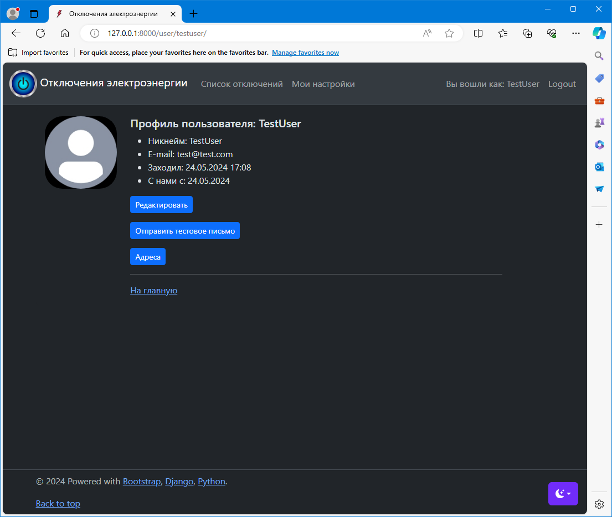

## WEB-приложение для автоматизированного оповещения по E-mail о плановых отключениях электроэнергии 

***

На основе план-графика отключений электроэнергии местных электросетей
выполняется уведомление пользователей об отключениях по E-mail.

Пользователь регистрируется на сайте, вводя имя, E-mail  и пароль. Для успешной регистрации
необходимо подтвердить адрес E-mail, пройдя по ссылке, которая приходит на указанный пользователем адрес для
предотвращения несанкционированной рассылки спама и автоматической регистрации. После подтверждения адреса пользователь получает доступ в свой профиль, где может посмотреть либо изменить свои настройки.

Зарегистрированным пользователям так же доступен для просмотра список отключений.

Для оповещения об отключениях в профиле необходимо ввести адреса в формате "**улица, номер**".
Доступно до пяти адресов на одного пользователя. 

После этого сервис в автоматическом режиме проверяет введенные адреса на наличие в своей базе данных отключений, которая регулярно обновляется данными с официального сайта электросетей.

Электросети не предоставляют возможности автоматического оповещения, поэтому приложение берет эту функцию на себя.
***
Приложение основано на следующих технологиях/фреймворках:

* Функционал WEB-приложения: Django framework
* Стилизация интерфейса: Bootstrap 
* Парсинг и обработка данных: BeautifulSoup/Requests
* БД: SQLite, формат входных данных: JSON / парсинг

## Примеры интерфейса приложения

Основная страница:

Форма регистрации пользователя:

Список отключений:

Профиль пользователя:

Адреса:

На текущий момент реализован базовый функционал. Планируется дальнейшее развитие приложения,
в частности добавление Телеграм-бота. Следите за обновлениями!

